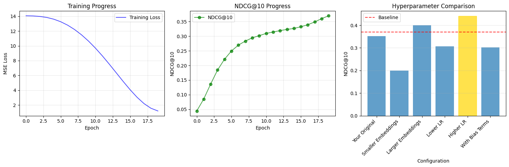
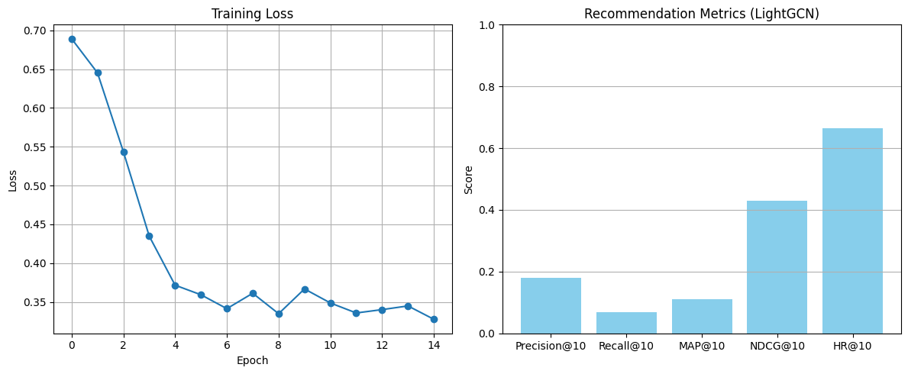
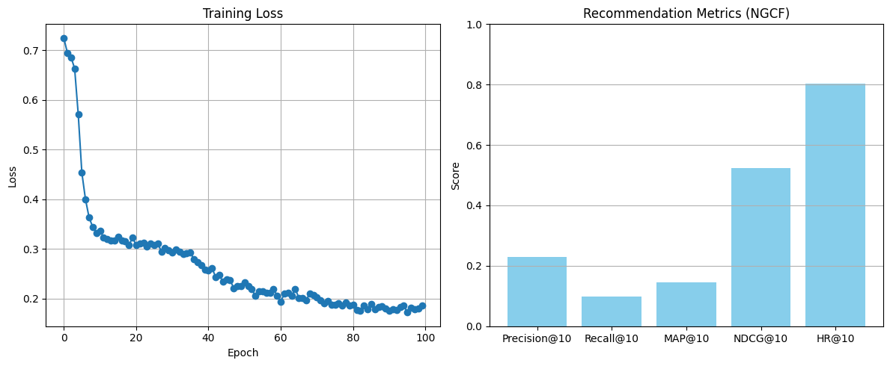

# Graphlix
# Graphlix: A Movie Recommendation System

This project explores three recommendation models – **Matrix Factorization (MF)**, **LightGCN**, and **Enhanced NGCF** – to build a personalized movie recommender. The goal was to experiment with baseline and graph-based collaborative filtering methods, evaluate them fairly, and integrate the best-performing model into a simple application that provides real-time recommendations.

---

## The Models

We started with **Matrix Factorization (MF)** as our baseline. It’s simple and effective for collaborative filtering, modeling user-item interactions by projecting both into a shared latent space. MF was trained using **stratified sampling** to ensure users with varying activity levels were proportionally represented in both training and evaluation splits.

  

The graph above shows how MF’s ranking metrics evolved during training. While it performed well for a baseline, its ability to model complex user-item relationships was limited.

Next, we implemented **LightGCN**, which simplifies traditional graph convolutional networks by removing unnecessary non-linearities and feature transformations. Unlike MF, LightGCN propagates embeddings over the user-item interaction graph to capture higher-order connectivity patterns.

  

While LightGCN brought improvements over MF, its simplified architecture limited expressiveness compared to NGCF in this dataset.

Finally, we enhanced the original **Neural Graph Collaborative Filtering (NGCF)** architecture by adding attention mechanisms, batch normalization, and dropout. These changes helped stabilize learning and capture more nuanced user-item relationships.

  

NGCF was trained without stratified sampling and evaluated on randomly selected users to handle the dataset’s size.

---

## Evaluation Strategy

Since the dataset was large, we evaluated all models on **300 randomly sampled users** with stratification to balance highly active and sparse users. This made the results both practical and representative of real-world scenarios.

  

---

## Why NDCG and MAP?

While **precision@k** is a common metric in recommender systems, it doesn’t account for *where* in the ranking the relevant items appear. To build a system that prioritizes placing relevant movies at the very top of the list, we chose:

- **NDCG (Normalized Discounted Cumulative Gain):** Rewards models for placing relevant items earlier in the ranking.
- **MAP (Mean Average Precision):** Considers the order of retrieved relevant items and averages this across users.

These metrics were more aligned with our goal of optimizing user experience in ranking-focused recommendations.

---

## Observations

- **Matrix Factorization:**
  - NDCG@10: ~0.36
  - MAP@10: ~0.25
  - Served as a reliable baseline but struggled with sparse users.

- **LightGCN:**
  - Brought improvements over MF but plateaued before NGCF’s performance.

- **Enhanced NGCF:**
  - NDCG@10: ~0.6 (unstratified evaluation)
  - Outperformed both MF and LightGCN. The addition of attention weights and regularization helped stabilize training and improved ranking quality.

---

## Why NGCF?

Even though LightGCN was lighter and easier to deploy, Enhanced NGCF consistently achieved better ranking metrics and captured more complex patterns in the user-item graph. Its ability to model non-linear interactions and leverage higher-order neighborhoods made it the natural choice for powering the recommendation engine.

---

## The Application

The app is simple for now:
- It accepts a single movie as input and computes recommendations dynamically.
- A **reverse mapping strategy** recalculates recommendations based on the user’s initial choice, making the system feel responsive even for first-time users.

---

## Future Improvements

This version of the app is a prototype, but there are plans to:
- Build a more robust recommendation flow that supports multiple inputs and context-aware suggestions.
- Integrate hybrid approaches for handling cold-start users more effectively.
- Deploy the system with caching and streaming capabilities to make recommendations near-instantaneous at scale.

